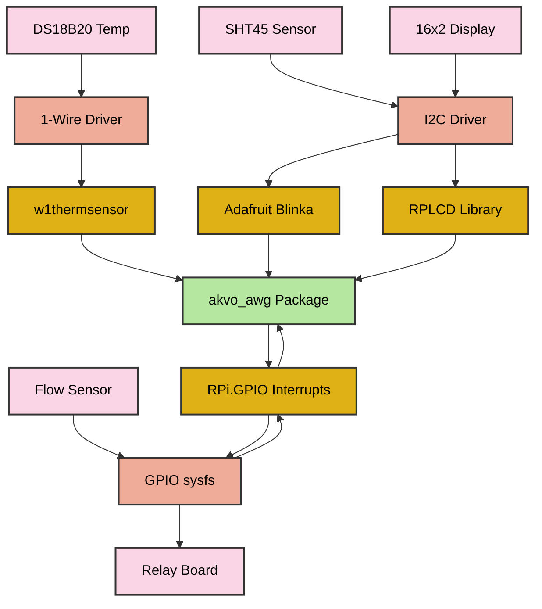
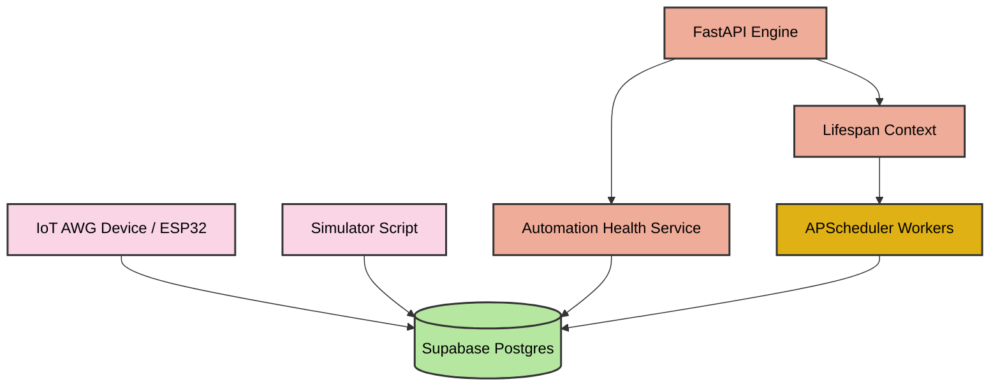

# 💧 AKVO AWG IoT Ecosystem — Full Technical Specification

[](https://www.raspberrypi.com/)
[](https://fastapi.tiangolo.com/)
[](https://supabase.com/)
[](https://www.python.org/)
[](https://systemd.io/)

Welcome to the absolute technical manual and specification blueprint for the **AKVO Atmospheric Water Generator (AWG) IoT Fleet Ecosystem**. This repository represents an industrial-grade, highly resilient automation solution that spans from **edge-level hardware sensing** on a Raspberry Pi 3A to **cloud-level telemetry analytics and automated scheduling** using FastAPI and Supabase.

Originally refactored and adapted from legacy ESP32 firmware, this system ensures Akvosphere generators harvest pure drinking water from ambient humidity with maximum electrical safety, dynamic monitoring, and fleet-wide diagnostic transparency.

Developed by **S Raghul Deepan** for **Akvosphere**.

---

## 🗂️ Table of Contents
1. [🌟 System Overview & Core Philosophy](#-system-overview--core-philosophy)
2. [🗂️ Clean Repository Architecture](#%EF%B8%8F-clean-repository-architecture)
9. [🚀 System Installation & Daemon Deployment](#-system-installation--daemon-deployment)
10. [🏢 About Akvosphere](#-about-akvosphere)

---

## 📂 System Documentation Index

We have established dedicated `/readme` directories containing modular, comprehensive guides for both components of the AKVO IoT fleet:

### 🔌 Edge Hardware & Controller Documentation
* **🔌 [Hardware Wiring & Pin Mappings](file:///c:/Users/mith1/OneDrive/Desktop/AKVO/Rasp/readme/hardware_wiring.md)**: Physical pinouts, electrical pull-up guidelines, and electrical isolation practices.
* **🤖 [FSM State Machine & Relay Logic](file:///c:/Users/mith1/OneDrive/Desktop/AKVO/Rasp/readme/state_machine.md)**: Transition tables, truth maps, safety timers, and mode exit conditions.
* **🏗️ [Software Architecture & Execution Stack](file:///c:/Users/mith1/OneDrive/Desktop/AKVO/Rasp/readme/architecture.md)**: Monotonic scheduler design, module specifications, and thread-safe interrupts.
* **🚀 [Installation, Operation & Service Daemon](file:///c:/Users/mith1/OneDrive/Desktop/AKVO/Rasp/readme/installation_and_operation.md)**: Step-by-step setup, debugging scans, and systemd deployment.

### ⚙️ IoT Cloud Backend Documentation
* **🏗️ [Backend System Architecture](file:///c:/Users/mith1/OneDrive/Desktop/AKVO/Rasp/automation_engine/readme/architecture.md)**: FastAPI layout, lifespan hooks, settings settings, and directory responsibilities.
* **🚀 [Installation, Setup & Operation](file:///c:/Users/mith1/OneDrive/Desktop/AKVO/Rasp/automation_engine/readme/installation_and_operation.md)**: Virtual environment commands, `.env` configurations, Uvicorn execution, and REST API diagnostics.
* **🗄️ [Database Schema & Services Layer](file:///c:/Users/mith1/OneDrive/Desktop/AKVO/Rasp/automation_engine/readme/database_and_services.md)**: Supabase Postgres tables (`esp_sensor_data`), Pydantic models, query decoupling, and fleet health algorithms.
* **🧪 [Simulation & Automated Testing](file:///c:/Users/mith1/OneDrive/Desktop/AKVO/Rasp/automation_engine/readme/simulation_and_testing.md)**: CLI simulator parameters, scenario matrices (Offline, Mismatch, Cycling), and validation rule workflows.
* **🎭 [Comical Architect's Guide](file:///c:/Users/mith1/OneDrive/Desktop/AKVO/Rasp/automation_engine/readme/comedy_architecture_guide.md)**: A hilarious, highly engaging, and complete detailed operational tour of the cloud backend!

---

## 🌟 System Overview & Core Philosophy

Harvesting water from the air requires strict controls over physical components. Rapidly switching a cooling compressor ON and OFF, running a water pump dry, or operating a compressor without active condenser fan airflow will lead to catastrophic hardware locks, frozen evaporator grids, or electrical overflows.

The **AKVO IoT Ecosystem** is split into two distinct, highly decoupled modules:
1. **The Edge Controller (`akvo_awg`)**: A local Python package running as a system daemon on a Raspberry Pi 3A. It reads physical sensors (Ambient humidity SHT45, Pipe temperature DS18B20, Water flow sensor, and safety water level float switches) and operates a timed, cooperative finite state machine to drive opto-isolated high-current relays (Fan, Compressor, Pump) without blocking CPU timers.
2. **The Cloud Backend (`automation_engine`)**: A FastAPI and Supabase server that collects real-time telemetry from thousands of AWG machines, logs time-series data, schedules background validation cron tasks using APScheduler, and exposes endpoints to compute real-time machine health scores (identifying offline systems, rapid cycling, and fan/compressor mismatches).

---

## 🗂️ Clean Repository Architecture

The codebase is structured following professional Python standards, separating active system packages, sub-documentation, scraper utility backups, and environment configurations:

```text
AKVO-intern/
├── akvo_awg/               # 📦 Core Python package (Edge Sensor Monitor & FSM)
│   ├── sensors/            #   ├── Submodule for physical sensor drivers (SHT45, DS18B20)
│   ├── config.py           #   ├── BCM pinout configurations & safety thresholds
│   ├── state.py            #   ├── Thread-safe shared global system state
│   ├── flow.py             #   ├── Interrupt-driven flow rate accumulator
│   ├── lcd.py              #   ├── PCF8574-driven 16x2 flickless paged display
│   ├── relay_logic.py      #   ├── FSM transition rules & relay state definitions
│   ├── logger.py           #   ├── Centralized system logging wrapper
│   └── main.py             #   └── Continuous, cooperative non-blocking task loop
├── automation_engine/      # ⚙️ FastAPI & Supabase IoT Cloud Backend
│   ├── app/                #   ├── Primary FastAPI package
│   │   ├── config/         #   │   └── Pydantic environment configuration loader
│   │   ├── database/       #   │   ├── Supabase client singleton & transactional queries
│   │   ├── services/       #   │   └── Fleet wellness score analytics
│   │   ├── scheduler/      #   │   └── APScheduler background cron definitions
│   │   ├── automations/    #   │   └── Alert rules (Offline checks, Rapid Toggles)
│   │   ├── models/         #   │   └── Pydantic telemetry data schemas
│   │   └── main.py         #   │   └── FastAPI route handlers & Lifespan context hooks
│   ├── .env.example        #   ├── Template for Supabase backend environment credentials
│   └── simulator.py        #   └── CLI scenario generator (Normal, Mismatches, Offlines)
├── backups/                # 📂 Archive directory containing legacy single-file script backups
├── readme/                 # 📂 Detailed system sub-specifications
├── README.md               # 📄 Consolidated Master Documentation Blueprint
├── main.py                 # 🚀 Unified Edge runner (Executes the local package)
├── requirements.txt        # 📋 Master third-party Python package dependencies
└── .gitignore              # 🧹 Standard Git exclusions (system caches, local copy folders)
```

---

## 🔌 Edge Hardware Wiring & BCM Pinout (Raspberry Pi 3A)

The edge controller operates using the **BCM (Broadcom) GPIO numbering scheme**. Below is the complete hardware pin mapping table:

| Component Name | Physical Component | BCM Pin | Physical Pin | I/O Direction | Electrical & Pull-Up Guidelines |
| :--- | :--- | :---: | :---: | :---: | :--- |
| **`DS18B20`** | Copper Pipe Temp | **GPIO 4** | Pin 7 | Input | Requires kernel 1-Wire driver and a **4.7kΩ pull-up** between DATA and 3.3V. |
| **`SHT45 SDA`** | Ambient Temp & RH | **GPIO 2** | Pin 3 | Bidirectional | Shared I2C1 Data. Physical 1.8kΩ pull-ups present on Pi. |
| **`SHT45 SCL`** | Ambient Temp & RH | **GPIO 3** | Pin 5 | Output | Shared I2C1 Clock. Physical 1.8kΩ pull-ups present on Pi. |
| **`LCD SDA`** | 16x2 LCD via PCF8574 | **GPIO 2** | Pin 3 | Bidirectional | Shared I2C1 Data line. |
| **`LCD SCL`** | 16x2 LCD via PCF8574 | **GPIO 3** | Pin 5 | Output | Shared I2C1 Clock line. |
| **`MR-L10-S`** | Hall-Effect Flow Sensor | **GPIO 17** | Pin 11 | Input (Interrupt) | Falling-edge trigger. Requires **10kΩ external pull-up** to 3.3V for edge clean-up. |
| **`FLOAT_SINK`** | Internal Sink Float | **GPIO 24** | Pin 18 | Input | Active LOW. Enabled with internal pull-up (`PUD_UP`). Reads LOW when full. |
| **`FLOAT_TANK`** | External Storage Float | **GPIO 25** | Pin 22 | Input | Active LOW. Enabled with internal pull-up (`PUD_UP`). Reads LOW when full. |
| **`RELAY_FAN`** | Condenser Cooling Fan | **GPIO 27** | Pin 13 | Output | Active HIGH. Drives opto-isolated relay circuit to prevent high coil load back EMF. |
| **`RELAY_COMP`**| Power Compressor | **GPIO 22** | Pin 15 | Output | Active HIGH. Must use isolated driver block. |
| **`RELAY_PUMP`**| Water Extraction Pump | **GPIO 23** | Pin 16 | Output | Active HIGH. Prevents dry running via software timeouts. |



---

## 🤖 Finite State Machine (FSM) & Relay Automation

The edge controller governs operational safety states via an automated Finite State Machine, preventing compressor short-cycles and guaranteeing safe component lead and lag durations.

### FSM State Transition Path

```mermaid
stateDiagram-v2
    [*] --> STARTUP : Power ON
    STARTUP --> FAN_ONLY : Immediate Transition
    
    note right of FAN_ONLY : Fan ON | Compressor OFF | Pump OFF
    FAN_ONLY --> AWG_RUN : Timer >= 300s (5 Min)\n(Establishes airflow, pre-cools grid)
    
    note right of AWG_RUN : Fan ON | Compressor ON | Pump OFF
    AWG_RUN --> TANK_FULL : Tank Float = LOW (Full)
    AWG_RUN --> PUMPING : Sink Float = LOW (Water present)
    
    note right of PUMPING : Fan ON | Compressor ON | Pump ON
    PUMPING --> TANK_FULL : Tank Float = LOW (Full)
    PUMPING --> AWG_RUN : Sink Float = HIGH (Drained)\nOR Pump Timeout >= 120s (Stuck Float fallback)
    
    note right of TANK_FULL : Fan OFF | Compressor OFF | Pump OFF
    TANK_FULL --> FAN_ONLY : Timer >= 1800s (30 Min)\n(Sleep cycle over; tests float switch state)
```


### Relay Operation Truth Table
Depending on the active state, the Broadcom registers are driven to HIGH (`True`) or LOW (`False`) atomically:

| Active FSM State | Fan Relay (GPIO 27) | Compressor Relay (GPIO 22) | Pump Relay (GPIO 23) | Functional Purpose |
| :--- | :---: | :---: | :---: | :--- |
| **`STARTUP`** | 🔴 OFF | 🔴 OFF | 🔴 OFF | Temporary boot frame. Immediately records time and transitions. |
| **`FAN_ONLY`** | 🟢 ON | 🔴 OFF | 🔴 OFF | Fan lead cycle. Pulls air through channels before compressor starts up. |
| **`AWG_RUN`** | 🟢 ON | 🟢 ON | 🔴 OFF | Primary harvesting mode. Compressor grid chills and condenses ambient water. |
| **`PUMPING`** | 🟢 ON | 🟢 ON | 🟢 ON | Active extraction. Empties the internal sink collector into the main tank. |
| **`TANK_FULL`** | 🔴 OFF | 🔴 OFF | 🔴 OFF | Safety sleep state. Power-down to prevent water spills or over-filling. |

---

## 🔄 Edge Software Orchestrator (`akvo_awg`)

### 1. The Monotonic Timing Scheduler
Unlike traditional embedded scripts that rely on multiple OS threads or blocking loops (which block the main execution thread), **AKVO AWG** utilizes a **single-threaded cooperative scheduler**.

By logging system timestamps via Python's drift-proof `time.monotonic()` clock, the loop evaluates and executes non-overlapping asynchronous tasks at precise, independent intervals:
* **Task 1: Calculate Water Flow** (Every 1.0s)
* **Task 2: Read Hardware Sensors** (Every 1.0s)
* **Task 3: Print Serial Logging Block** (Every 2.0s)
* **Task 4: Dynamic LCD Display Rotation** (Every 3.0s)
* **Task 5: Evaluate FSM Transitions & Relays** (Every loop cycle)

### 2. Thread-Safe Interrupt Service Routine (ISR)
The **MR-L10-S flow sensor** generates high-frequency electrical pulses as water spins its internal impeller. To prevent missed pulses during loop sleep cycles, the edge controller configures a hardware-level interrupt trigger:
* Staged inside `gpio_setup.py`, it binds a callback `flow_pulse_isr` to BCM **GPIO 17** on falling edges.
* The Linux kernel captures these triggers and spawns an independent worker thread to run the callback.
* **Race Condition Mitigation**: Because the background ISR thread writes to `state.pulse_count` while the main scheduler thread reads and resets `state.pulse_count` every 1 second, a potential race condition exists.
* **Data Lock**: A shared `lock = threading.Lock()` is acquired during read/write cycles to ensure pulse accumulation is thread-safe:

```python
# Thread-safe read and reset block inside flow.py
with lock:
    pulses = state.pulse_count
    state.pulse_count = 0  # atomically reset for next calculation

litres_this_cycle = pulses / PULSES_PER_LITRE
state.flow_rate_lmin = litres_this_cycle * 60.0
state.total_volume_l += litres_this_cycle
```

### 3. Flickless Paged LCD Display
The PCF8574-driven 16x2 paged LCD UI is managed in `lcd.py`. Clears (`lcd.clear()`) are highly expensive and cause distracting screen flickering if called repeatedly.
* **Solution**: The module implements **differential rendering**. It tracks the active page (`_last_rendered_page`). Labels and layout grids are redrawn *only* when the page rotates.
* During the standard 3-second task loop, the dynamic values are written directly to their respective coordinates, overwriting old data in-place without flashing the backlight:
  * **Page 0 (Temperature)**: Renders Copper Pipe Temp (°C) and Ambient Temp (°C).
  * **Page 1 (Humidity & Flow)**: Renders Relative Humidity (%) and active Flow Rate (L/min).
  * **Page 2 (Water Yield)**: Renders Total Accumulated Water Volume (Liters).

---

## ⚙️ Cloud Backend Architecture (`automation_engine`)

The **AKVO Automation Engine** is a high-performance, asynchronous FastAPI backend designed to collect telemetry, schedule automation scripts, and manage database connection pools cleanly.



### 1. Lifespan Event Hooks
The FastAPI app utilizes **lifespan context managers** (`@asynccontextmanager`) to manage system start and stop operations gracefully.
* **On Server Boot**: Exposes settings schemas parsed from `.env` and immediately spins up background thread pools (`start_scheduler()`).
* **On Server Shutdown**: Deactivates cron queues gracefully (`shutdown_scheduler()`), ensuring any active database operations finish cleanly to prevent socket pool leaks.

### 2. Centralized Pydantic Configuration
All environment variables are loaded and validated using Pydantic Settings. Missing parameters, bad integers, or invalid database URLs will throw errors immediately at launch rather than failing silently at runtime.

---

## 🗄️ Supabase Telemetry Schema & Cloud Analytics

### 1. PostgreSQL Database Schema (`esp_sensor_data`)
Every time an AWG device posts telemetry, the values are written to the time-series table `esp_sensor_data` in Supabase:

| Column Name | Data Type | Description |
| :--- | :--- | :--- |
| **`id`** | `bigint` (PK, Identity) | Auto-incrementing primary key ID. |
| **`created_at`** | `timestamp with time zone` | Automatic database timestamp when written. |
| **`machine_id`** | `text` (Indexed) | Target AWG machine identifier (e.g., `machine_001`). |
| **`esp_log_at`** | `timestamp with time zone` | Accurate UTC log time generated by the device's processor. |
| **`relative_humidity`**| `double precision` | Ambient Relative Humidity (%). |
| **`external_temperature`**| `double precision`| Ambient coil-inflow temperature (°C). |
| **`compressor_status`**| `boolean` | State of the cooling compressor relay. |
| **`fan_status`** | `boolean` | State of the primary condenser fan relay. |
| **`lcd_status`** | `boolean` | State of the liquid crystal display. |
| **`pump_status`** | `boolean` | State of the active extraction pump relay. |
| **`mode`** | `text` | System mode (`auto`, `manual`, `sleep`). |
| **`int_tank_full`** | `boolean` | Float switch state indicating if the tank is full. |
| **`water_level`** | `double precision` | Quantity of water logged inside main storage (%). |
| **`voltage`** | `double precision` | Grid voltage (V). |
| **`current`** | `double precision` | Current drawn by active hardware blocks (A). |
| **`watts`** | `double precision` | Grid power consumed (Watts). |
| **`wifi_strength`** | `integer` | Signal RSSI (dBm). |
| **`fault_code`** | `text` (Nullable) | Diagnostic fault indicators (e.g., `FAN_STOPPED`). |

### 2. Decoupled Queries Layer (`app/database/queries.py`)
To prevent spaghetti code, raw database selections, inserts, and filters are isolated within a dedicated query layer. This shields API route handlers and services from direct database SDK dependencies.

### 3. Fleet-Wide Wellness Scoring
The backend services layer (`app/services/automation_health.py`) analyzes time-series telemetry histories over a rolling 24-hour window to calculate operational health scores for each AWG machine. The analysis checks for:
* **Online Status**: Determines if a machine has failed to transmit log entries within a specific threshold (e.g., last 5 minutes).
* **Fan Mismatches**: Checks if the compressor is running while the fan is OFF. If a fan motor fails, the evaporator coils will ice over, which can damage the compressor.
* **Rapid Cycling**: Checks if the compressor toggles ON/OFF repeatedly within a tight window (e.g. 5+ toggles in 10 minutes), indicating a faulty switch or threshold bounce.
* **Thermal Violations**: Flags warning alerts if system preheats or cooldown cycles were bypassed.

---

## 🧪 Dry-Run Time-Series Simulation (`simulator.py`)

To validate backend rules, verify alert thresholds, and dry-run wellness scoring services without needing a physical generator, use the CLI simulation tool (`simulator.py`).

The script pushes sequence data directly into your Supabase Postgres database. You can execute various operational profiles using the `--scenario` parameter:

### Simulation Scenario Profiles:
1. **`normal_operation`**: Simulates a healthy operating cycle. Evaporator fan runs alone for 5 minutes (lead phase), compressor runs, shuts down, and the fan continues running for 3 minutes (cooldown phase) before turning off.
2. **`offline`**: Emulates network drops or power outages. Writes telemetry rows where the latest entry is timestamped more than 8 minutes ago.
3. **`rapid_cycling`**: Simulates compressor ON/OFF states toggling repeatedly at 1-minute intervals over a 10-minute window (indicative of a faulty pressure switch).
4. **`fan_mismatch`**: Simulates an evaporator fan motor failure. The fan turns OFF while the compressor continues to run, automatically injecting a `fault_code="FAN_STOPPED"`.
5. **`improper_startup`**: The compressor starts directly from a system-off state without running the fan first (lead phase safety violation).
6. **`improper_shutdown`**: The fan and compressor shut down at the exact same minute, skipping the required fan cooldown phase (lag phase safety violation).

### How to Run a Simulation Test:
1. Ensure your FastAPI server is active.
2. In a separate terminal, trigger a test scenario:
   ```bash
   python simulator.py --scenario fan_mismatch --machine-id test_machine_99
   ```
3. Query the health endpoint to verify the backend rules detect the anomaly:
   ```bash
   curl http://127.0.0.1:8000/automation-health
   ```
4. Expected JSON Response:
   ```json
   {
     "status": "warning",
     "window_hours": 24,
     "automations": {
       "test_machine_99": {
         "health_score": 25.0,
         "fan_mismatch_detected": true,
         "fault_code_reported": "FAN_STOPPED",
         "rapid_cycling_detected": false,
         "online_status": "online"
       }
     }
   }
   ```
   *(Note: The health score is degraded due to the safety violation, proving the backend rules engine works perfectly!)*

---

## 🚀 System Installation & Daemon Deployment

This section walks you through configuring hardware interfaces, installing system and library dependencies, and deploying the edge controller as a robust system daemon on a Raspberry Pi.

### 1. Enable Hardware Interfaces (RPi Boot Config)
Open the boot configuration file:
```bash
sudo nano /boot/config.txt
```
*(Note: On newer Raspberry Pi OS Bookworm or later releases, this file is located at `/boot/firmware/config.txt`)*

Append the following lines to load the I2C and 1-Wire overlays:
```ini
dtparam=i2c_arm=on
dtoverlay=w1-gpio,gpiopin=4
```
Save the file and reboot the Raspberry Pi:
```bash
sudo reboot
```

### 2. Install System Packages & Python Libraries
Once booted, update the local package index, install required system utilities, and install the Python dependencies:
```bash
# Install system packages
sudo apt update && sudo apt install -y python3-pip python3-smbus i2c-tools python3-dev

# Install Python packages (break-system-packages is required on modern Debian releases)
pip3 install -r requirements.txt --break-system-packages
```

### 3. Verify Hardware Interfaces
Before starting the software, check that all physical sensors are recognized by the operating system:
* **Scan the I2C Bus**:
  ```bash
  i2cdetect -y 1
  ```
  Expected output: `0x27` (LCD display) and `0x44` (SHT45 sensor).
* **Scan the 1-Wire Bus**:
  ```bash
  ls /sys/bus/w1/devices/
  ```
  A folder starting with `28-...` must be listed, representing your DS18B20 pipe temperature sensor.

### 4. Run the Edge Controller
You can launch the system manually from the root workspace directory using:
```bash
sudo python3 main.py
```
*(Note: `sudo` is required to allow Python direct access to the Broadcom GPIO register channels).*

### 5. Configure as a Boot-Persistent System Daemon (Systemd)
To ensure the controller starts automatically on boot and runs reliably in the background, configure it as a systemd service.

1. Create a new service description file:
   ```bash
   sudo nano /etc/systemd/system/akvo-awg.service
   ```
2. Paste the configuration block below (adjust the `WorkingDirectory` and paths to match your local setup):
   ```ini
   [Unit]
   Description=AKVO AWG Sensor Monitoring System Service
   After=multi-user.target network.target

   [Service]
   Type=simple
   ExecStart=/usr/bin/python3 /home/pi/Rasp/main.py
   WorkingDirectory=/home/pi/Rasp
   StandardOutput=journal
   StandardError=journal
   Restart=always
   RestartSec=5
   User=root

   [Install]
   WantedBy=multi-user.target
   ```
3. Load, enable, and start the system daemon:
   ```bash
   sudo systemctl daemon-reload
   sudo systemctl enable akvo-awg.service --now
   ```
4. View real-time logs:
   ```bash
   sudo journalctl -u akvo-awg.service -f
   ```

---

## 🏢 About Akvosphere

Akvosphere manufactures world-class Atmospheric Water Generators designed to harvest pure, clean drinking water directly from the humidity in the air. This Raspberry Pi monitoring solution enables intelligent automation, real-time volume diagnostics, and reliable fail-safe states to keep Akvosphere generators operating optimally around the clock.
