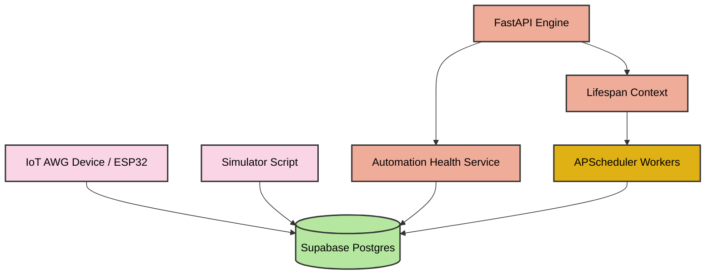

# ⚙️ AKVO Automation Engine — Industrial IoT Backend

[](https://fastapi.tiangolo.com/)
[](https://supabase.com/)
[](https://www.python.org/)
[](https://apscheduler.readthedocs.io/)

A production-grade, highly scalable **Industrial IoT Automation Backend** designed to monitor, track, and automate **Akvosphere Atmospheric Water Generator (AWG)** fleets. Built with **FastAPI**, **APScheduler**, and **Supabase (PostgreSQL)**, this engine acts as the centralized brain—receiving machine telemetry, running advanced background safety analysis cron jobs, tracking fleet-wide wellness indicators, and dynamically scheduling hardware operational checks.

Developed by **Akvosphere**.

---

## 📂 Backend Documentation Index

We have established a dedicated `/readme` directory containing modular, comprehensive guides for each part of the system. Click the links below to explore the deep documentation:

* **🏗️ [Backend System Architecture](file:///C:/Users/mith1/OneDrive/Desktop/AKVO/Rasp/automation_engine/readme/architecture.md)**: FastAPI layout, lifespan hooks, settings schemas, and directory responsibilities.
* **🚀 [Installation, Setup & Operation](file:///C:/Users/mith1/OneDrive/Desktop/AKVO/Rasp/automation_engine/readme/installation_and_operation.md)**: Virtual environment commands, `.env` setups, Uvicorn runs, and REST API diagnostics.
* **🗄️ [Database Schema & Services Layer](file:///C:/Users/mith1/OneDrive/Desktop/AKVO/Rasp/automation_engine/readme/database_and_services.md)**: Supabase Postgres tables (`esp_sensor_data`), Pydantic models, query decoupling, and machine wellness algorithms.
* **🧪 [Simulation & Automated Testing](file:///C:/Users/mith1/OneDrive/Desktop/AKVO/Rasp/automation_engine/readme/simulation_and_testing.md)**: CLI parameters, test scenarios (Normal, Offline, Mismatch, Cycling), and backend rule validation workflows.
* **🎭 [Comical Architect's Guide](file:///C:/Users/mith1/OneDrive/Desktop/AKVO/Rasp/automation_engine/readme/comedy_architecture_guide.md)**: A hilarious, highly engaging, and complete detailed operational tour of the cloud backend!

---

## 🗂️ Clean Repository Architecture

The repository directory layout is organized following modern best practices to keep the API server, database scripts, backups, and documentation cleanly decoupled:

```text
automation_engine/
├── app/                    # 📦 Core FastAPI backend package
│   ├── config/             #   ├──Centralized settings & env validations
│   ├── database/           #   ├──Supabase client singleton & query layer
│   ├── services/           #   ├──Fleet wellness algorithms & health logic
│   ├── scheduler/          #   ├──APScheduler setup & cron metrics
│   ├── automations/        #   ├──Orchestration logic & hardware rules
│   ├── models/             #   ├──Pydantic schemas & telemetry models
│   └── main.py             #   └──FastAPI entrypoint & Lifespan hooks
├── backups/                # 📂 Legacy backups and original script copies
├── readme/                 # 📂 Detailed system design sub-documentation
│   ├── architecture.md     #   ├──FastAPI layouts & lifecycles
│   ├── database_services.md#   ├──Supabase schemas & wellness logic
│   ├── installation.md     #   ├──Setup, Uvicorn runs & API curls
│   └── simulation.md       #   └──CLI simulator scripts & test scenarios
├── .env.example            # 📋 Template file for local database environment configs
├── simulator.py            # 🚀 Telemetry simulation script (dry-runs FSM rules)
├── test_freeze.py          # 🧪 Small test script for verifying imports
└── requirements.txt        # 📋 Python third-party dependency manifests
```

---

## 🗺️ System Architecture Overview



---

## 🌟 Key Features

* **⚡ FastAPI Life-cycle Lifespan**: Controls system startup and shutdown events cleanly, bootstrapping connections and deactivating active background workers during stops.
* **⏲️ Background Cron Scheduler**: Utilizes **APScheduler** to execute critical, high-frequency fleet validation cron tasks at predefined, non-overlapping intervals.
* **🛡️ Fleet Wellness Analyses**: Exposes the `/automation-health` route, executing advanced metrics analysis over a rolling 24-hour log window to immediately flag rapid cycling, network dropouts, and fan failures.
* **📊 Decoupled Database Layer**: Isolates Supabase CRUD connections in `supabase_client.py` and encapsulates SQL queries inside `queries.py` to preserve package modularity.
* **🧪 Time-Series Telemetry Simulator**: Features a versatile command-line simulator (`simulator.py`) supporting multiple scenario matrices to dry-run backend alerts.

---

## ⚡ Quick Start Guide (Terminal)

For detailed step-by-step instructions, please consult the **[Installation and Operation Guide](file:///C:/Users/mith1/OneDrive/Desktop/AKVO/Rasp/automation_engine/readme/installation_and_operation.md)**. Here is the quick-reference cheat sheet for local run:

### 1. Environment Setup
```bash
# Windows
python -m venv .venv
.venv\Scripts\activate

# Linux / macOS
python3 -m venv .venv
source .venv/bin/activate
```

### 2. Dependency Setup
```bash
pip install -r requirements.txt
```

### 3. Environment Config
```bash
# Windows (PowerShell)
Copy-Item .env.example .env

# Linux / macOS
cp .env.example .env
```
*Open `.env` and fill in your custom `SUPABASE_URL` and `SUPABASE_KEY`.*

### 4. Launch FastAPI Server
```bash
uvicorn app.main:app --reload
```
*The service will launch at [http://127.0.0.1:8000](http://127.0.0.1:8000).*

### 5. Run Scenarios Simulation
In a separate terminal, trigger a test:
```bash
python simulator.py --scenario fan_mismatch
```
Query `/automation-health` to check if the fault was detected:
```bash
curl http://127.0.0.1:8000/automation-health
```
