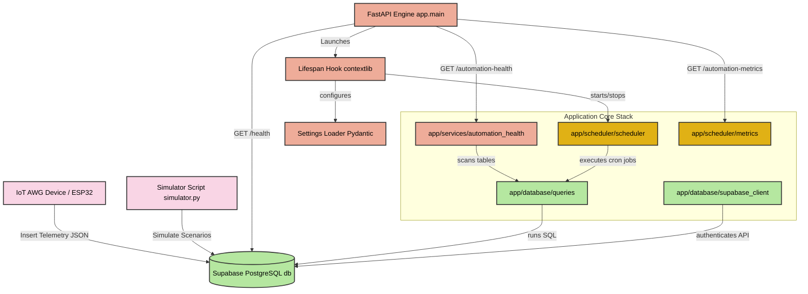

# 🏗️ Backend System Architecture

This document outlines the software architecture, modular directories, and design patterns of the **AKVO Automation Engine Backend**. The system is built as a production-grade industrial IoT telemetry orchestrator using **FastAPI**, **APScheduler**, and **Supabase (PostgreSQL)**.

---

## 🗺️ Logical Architecture Flowchart

The diagram below maps the runtime architecture and data flows from incoming IoT machine telemetry to Supabase tables, FastAPI lifecycles, and scheduled background workers:

---

## 🗂️ Project Directory Specifications

The backend follows a domain-driven folder layout to keep API routing, cron workers, database logic, and diagnostic services cleanly decoupled:

* **📂 `app/`** (Primary application root)
  * **📄 `__init__.py`**: Initializer making the folder an importable package.
  * **📄 `main.py`**: Entry point of the FastAPI application. Sets up global logging, lifespan event hooks (APScheduler initialization/shutdown), and exposes standard system status and diagnostic endpoints.
  * **📂 `config/`** Centralized configuration domain.
    * **📄 `settings.py`**: Uses Pydantic base settings to read, parse, and validate environment configurations (`.env`) with default fallback values (DB URLs, keys, logging levels, app name).
  * **📂 `database/`** Supabase PostgreSQL connectivity and operations.
    * **📄 `supabase_client.py`**: Initializes and exposes the verified Supabase Client instance singleton.
    * **📄 `queries.py`**: Exposes reusable database transactional scripts, insulating the business logic from direct raw table inserts/selects.
  * **📂 `automations/`** Define IoT business rules (e.g., triggering alerts if ambient humidity drops below a certain range or if a compressor rapid-cycles).
  * **📂 `services/`** Aggregates cross-functional logic like polling telemetry histories and assembling machine wellness scores.
    * **📄 `automation_health.py`**: Gathers and maps recent telemetry records to calculate operation health summaries for the connected AWG fleet.
  * **📂 `scheduler/`** Background worker engine.
    * **📄 `scheduler.py`**: Configures and controls **APScheduler** (Advanced Python Scheduler). Runs cron-like background jobs on pre-configured intervals.
    * **📄 `metrics.py`**: Accumulates and retrieves job diagnostics, run records, and verification timestamps.
  * **📂 `models/`** Holds data model structures and Pydantic schemas representing telemetry records.
* **📄 `simulator.py`**: A CLI simulation tool. Generates complex operational scenarios (Improper Startup, Offline, Mismatches) to dry-run backend alert thresholds.
* **📄 `requirements.txt`**: Centralized dependency list of libraries.
* **📄 `.env.example`**: Outlines the mandatory database environment credentials required to run.

---

## 🔄 Lifecycle Management (Lifespan Hooks)

The application utilizes FastAPI's advanced **Lifespan Hook Context Manager** (`@asynccontextmanager`) to manage startup and shutdown events cleanly:

1. **On Startup**:
   * Initializes logging configurations driven by `.env`.
   * Verifies connectivity to the Supabase backend.
   * Bootstraps the background task scheduler (`start_scheduler()`).
2. **On Yield**: Exposes API endpoints and handles incoming client network requests.
3. **On Shutdown**:
   * Gracefully deactivates active scheduled cron jobs (`shutdown_scheduler()`).
   * Closes active network connections to prevent database pool leaks or unfinished transactions.
