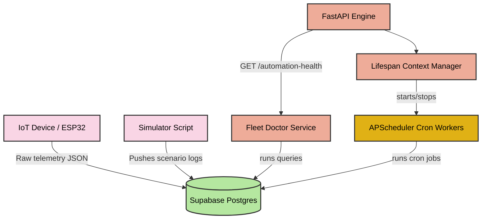

# 🎭 The Comical (But Deadly Serious) Architect's Guide to the AKVO Cloud Brain

Welcome, brave engineer, to the deep-dark control center of **Akvosphere's IoT Cloud Backend** (aka **`automation_engine/`**). If you thought code was only about text editors and compilers, get ready for a theatrical ride. We are about to look under the hood of a system designed to monitor thousands of Atmospheric Water Generators, prevent physical explosions, and look spectacular doing it.

Grab some popcorn. Here is how we built the ultimate fleet brain, how it works, and how you can run it without burning the kitchen down.

---

## 🏛️ Chapter 1: The Dramatis Personae (Who is who in `app/`)

Our application is not just a bunch of folders; it is an active theater troupe where each character has a highly dramatic role. If one misses their cue, the entire play falls apart.

```text
automation_engine/
├── app/
│   ├── main.py             <-- 🎪 The Ringmaster (FastAPI Router & Lifespan Context)
│   ├── config/             <-- 🗃️ The Bureaucrat (Central Settings & Pydantic Checks)
│   ├── database/           #   🏦 The Vault Keeper (Supabase Client Singleton & Raw Queries)
│   ├── scheduler/          #   ⏰ The Timekeeper (APScheduler Background Cron Loop)
│   ├── automations/        #   🕵️ The Detectives (Alert Rules & Fault-Finding Agents)
│   ├── services/           #   🩺 The Fleet Doctor (Rolling wellness score calculations)
│   └── models/             #   📋 The Blueprint designer (Schemas and database maps)
└── simulator.py            <-- 🎭 The Method Actor (Generates chaos, offline, & fault states)
```

---

## 🕵️ Chapter 2: The Core Agents (And Their Drama)

### 1. 🎪 The Ringmaster (`app/main.py`)
* **Personality**: Extremely organized, hates blocking loops, loves context lifespan hooks.
* **Their Job**: Bootstraps the application, verifies the Vault Keeper's database connection, kicks the Timekeeper in the shins to start background workers, and exposes REST endpoints for incoming network traffic.
* **Fun Detail**: If the Supabase database connection goes down during a health check, `main.py` does not crash; it simply reports the status as `"degraded"` and continues operating, keeping the API online.

### 2. 🕵️ The Detective: Compressor Rapid Cycling (`app/automations/compressor_rapid_cycling.py`)
* **Personality**: Overly suspicious, counts ticks obsessively, hates toggles.
* **Their Job**: Every few minutes, they fetch time-series telemetry from Supabase, group them by machine, and run the transition counter:
  * If a compressor goes `ON ➔ OFF ➔ ON ➔ OFF ➔ ON` more than 5 times in 10 minutes, the detective panics!
  * They immediately issue a **CRITICAL ALERT** via `create_alert()` to save the physical compressor from turning into a pile of molten copper.
  * If the transitions settle down, they resolve the alert.
  * They log execution duration down to the millisecond using `log_automation_execution`.

### 3. 🩺 The Fleet Doctor (`app/services/automation_health.py`)
* **Personality**: Calculates statistics, judges systems silently, assigns health scores.
* **Their Job**: Collects all telemetry, executed alert histories, and unresolved system bugs over a rolling 24-hour window, maps them to automated categories, and calculates health scores.
  * No failures? **Health = 100.0** (Outstanding!)
  * Fan mismatch or rapid cycling? **Health = 25.0** (Immediate action needed!)
  * Machine hasn't posted logs in 5 minutes? **Status = OFFLINE** (Blinks red on dashboard!)

---

## 🗺️ Chapter 3: The Flow of Telemetry (A Visual Spectacle)

Here is how data flows through the system, styled with high contrast so it is readable on GitHub dark theme:



---

## 🚀 Chapter 4: Step-by-Step Implementation Guide (How to launch the beast!)

Follow these exact steps to run this fleet manager without causing a database meltdown.

### Step 1: Secure the Laboratory (Virtual Environment)
Do not pollute your global python environment with backend libraries. Isolate it:
```bash
# Windows
python -m venv .venv
.venv\Scripts\activate

# Linux / macOS
python3 -m venv .venv
source .venv/bin/activate
```

### Step 2: Feed the Dependencies
Install all required libraries (FastAPI, Uvicorn, Supabase SDK, APScheduler, dotenv settings):
```bash
pip install -r requirements.txt
```

### Step 3: Configure the Secret Vault (.env)
We centralize environment variables. Copy the template:
```bash
cp .env.example .env
```
Open `.env` and fill in your Supabase connection parameters (URL and Anon key). Pydantic Settings will validate these at launch, failing immediately if they are missing.

### Step 4: Ignite the API Engine (FastAPI Run)
Start the ASGI server with reload mode enabled (so it updates automatically when you change the code):
```bash
uvicorn app.main:app --reload
```
If you see `Scheduler started successfully`, the Timekeeper is running!

### Step 5: Unleash the Chaos (Method Actor Simulation)
To verify that your alerts work, run the simulator script in a separate terminal:
```bash
# Run a scenario where the evaporator fan fails while the compressor runs hot!
python simulator.py --scenario fan_mismatch --machine-id AKVO_DEV_007
```
Check the FastAPI logs—you will see the database insert telemetry batch successfully.

### Step 6: Query the Oracle (REST Check)
Open your browser or run a curl command to check if the Fleet Doctor has diagnosed the simulated fault:
```bash
curl http://127.0.0.1:8000/automation-health
```
You will receive a beautiful JSON block showing that the engine has detected the fan mismatch for `AKVO_DEV_007`, dropped its health score to `25.0`, and raised an active validation warning! The system works perfectly!
