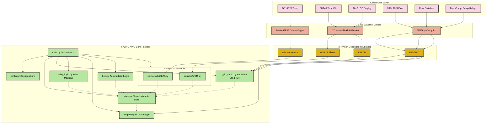

# 🏗️ Software Architecture & Design

This document details the software architecture, module layout, and execution mechanics of the **AKVO AWG Sensor Monitoring System**. The system has been designed as a modular, single-threaded, non-blocking asynchronous task orchestrator to ensure highly reliable operation on a Raspberry Pi 3A running Debian-based Linux.

---

## 🗺️ Software & Hardware Layer Stack

The system is structured into four distinct logical layers, moving from the physical sensor wires up to the orchestrated loop:



---

## 🗂️ File Directory Guide

The codebase is organized as a clean, standard Python package `akvo_awg/`. Below is a map of the package files and their responsibilities:

* **📂 `akvo_awg/`** (Root package folder)
  * **📄 `__init__.py`**: Exposes package markers and basic initialization.
  * **📄 `config.py`**: A centralized repository of GPIO BCM pins, calibration factors, I2C addresses, paged intervals, and FSM safety timeout durations.
  * **📄 `state.py`**: Declares `SystemState` (a thread-safe dataclass containing global flags, float readings, sensor values, flow metrics, and current FSM state). Instantiates the global singleton `state`.
  * **📄 `gpio_setup.py`**: Configures all GPIO inputs, outputs, pull-ups, and registers the high-frequency falling-edge interrupt service routine (ISR) for the flow sensor.
  * **📄 `relay_logic.py`**: Executes FSM rules and drives the fan, compressor, and pump relays atomically using monotonic timestamps.
  * **📄 `lcd.py`**: Manages the PCF8574-driven 16x2 LCD, switching pages dynamically and displaying formatted values in real time without screen flicker.
  * **📄 `flow.py`**: Converts raw sensor interrupts (pulse counts) to actual volume in Liters and water flow rate in Liters/minute.
  * **📄 `logger.py`**: Initializes standard Python logging (`DEBUG` level) and prints diagnostics to both `/var/log/syslog` (via systemd) and the serial console.
  * **📄 `main.py`**: The application entry point. Implements the continuous non-blocking task scheduler.
  * **📂 `sensors/`** (Sensors submodule)
    * **📄 `__init__.py`**: Exposes sensor reading functions.
    * **📄 `ds18b20.py`**: Reads pipe temperatures using the Linux 1-wire system filesystem `/sys/bus/w1/devices/`. Handles connection dropouts.
    * **📄 `sht45.py`**: Reads ambient humidity and temperature using the SMBus/I2C protocol. Contains automated retry logic if the sensor is disconnected.

---

## 🔄 The Non-Blocking Monotonic Scheduler

Unlike standard implementations that rely on multiple OS threads or blocking `time.sleep()` statements (which freeze the CPU and block user interfaces), **AKVO AWG** uses a **single-threaded cooperative scheduler** in `main.py`.

It tracks task timings using `time.monotonic()`, comparing the elapsed seconds against each task's desired interval. This guarantees:
1. **Zero drift**: Immune to system clock updates or NTP corrections.
2. **Dynamic UI**: The LCD display and relays update rapidly and continuously (every 100ms), while slow tasks (like logging or reading DS18B20 sensors) occur on their respective slower intervals.

### Orchestration Loop Core (Simplified Logic)

```python
# Timing intervals from config
while True:
    now = time.monotonic()

    # Task 1: Calculate Water Flow (Every 1.0s)
    if now - t_flow >= FLOW_CALC_INTERVAL:
        calculate_flow()
        t_flow = now

    # Task 2: Read Hardware Sensors (Every 1.0s)
    if now - t_sensor >= SENSOR_READ_INTERVAL:
        state.pipe_temp = get_temperature()
        read_sht45()
        t_sensor = now

    # Task 3: Print Console Logs (Every 2.0s)
    if now - t_serial >= SERIAL_LOG_INTERVAL:
        print_serial_log()
        t_serial = now

    # Task 4: Rotate LCD Screen Page (Every 3.0s)
    if now - t_lcd >= LCD_PAGE_INTERVAL:
        lcd_page = (lcd_page + 1) % 3
        t_lcd = now

    # Task 5: LCD Render Update (Every loop cycle)
    render_lcd(lcd, lcd_page)

    # Task 6: Evaluate FSM Transitions & Drive Relays (Every loop cycle)
    update_relay()  # inside: update_awg_state(now)

    # Cooperative Sleep (100ms buffer)
    time.sleep(LOOP_SLEEP)
```

---

## 🧵 Thread-Safe Pulse Accumulation

The **MR-L10-S flow sensor** generates brief electrical pulses at high frequencies as water passes through it. Because the main scheduler runs inside a `while True` loop that sleeps for 100ms at a time, polling the GPIO pin would lead to missed pulses.

### Solution: Hardware-Level Interrupts (ISR)
The software registers a hardware interrupt handler `flow_pulse_isr` with the Linux kernel on the falling edge of BCM GPIO 17:
* The kernel registers this edge trigger.
* When a pulse falls, `RPi.GPIO` automatically spawns an independent worker thread to execute `flow_pulse_isr()`.
* **State Synchronization**: Because the ISR thread increments `state.pulse_count` while the main scheduler thread reads and resets `state.pulse_count` every 1 second, a potential race condition exists.
* **Thread-Safety Lock**: The global `lock = threading.Lock()` defined in `state.py` is acquired by both threads during these read/write operations to guarantee data integrity:

```python
# Inside gpio_setup.py (ISR Thread Context)
def flow_pulse_isr(channel):
    with lock:
        state.pulse_count += 1

# Inside flow.py (Main Thread Context)
def calculate_flow():
    with lock:
        pulses = state.pulse_count
        state.pulse_count = 0  # atomically reset for next second

    # Safe calculation outside of lock block
    litres_this_cycle = pulses / PULSES_PER_LITRE
    state.flow_rate_lmin = litres_this_cycle * 60.0
    state.total_volume_l += litres_this_cycle
```
