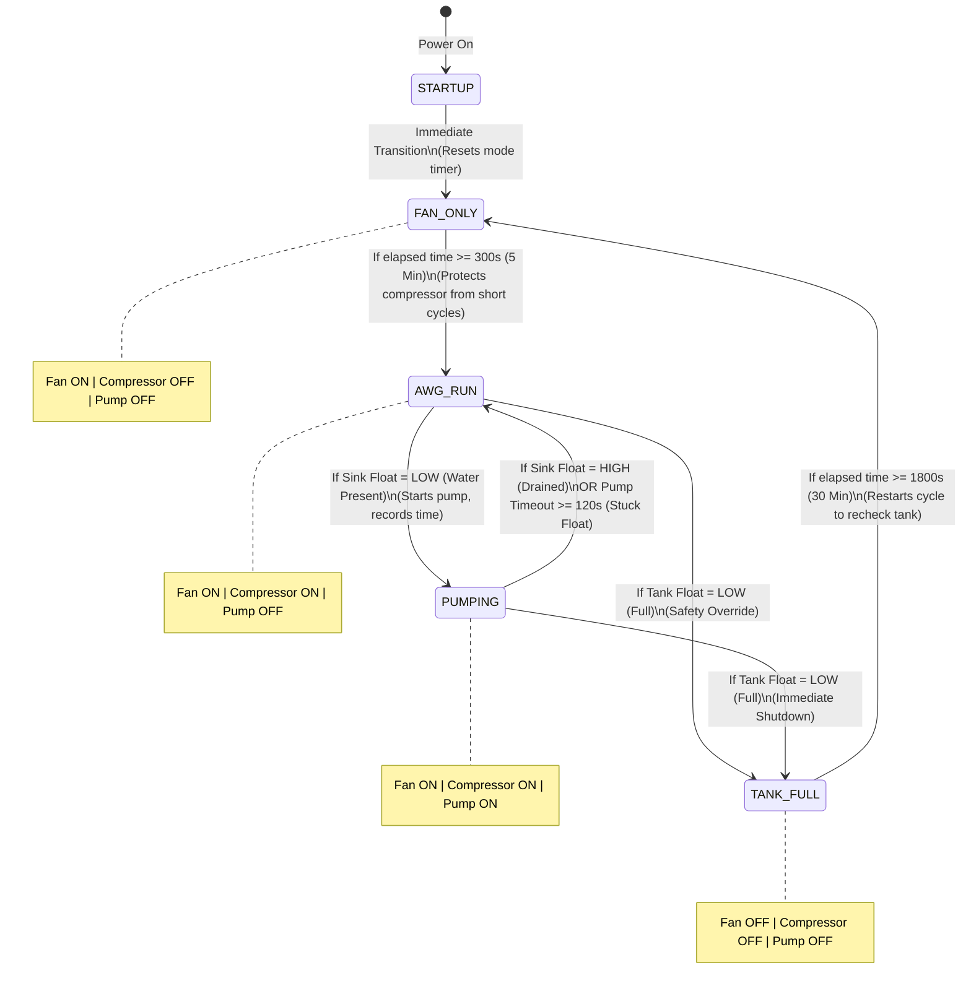

# 🤖 State Machine & Relay Control Logic

The core intelligence of the **AKVO AWG System** is designed as a finite state machine (FSM). This structure ensures that heavy components (specifically the compressor and pump) operate safely under tight rules, avoiding high-load failures, dry running, or tank overflows.

All timings are calculated using the CPU's **monotonic clock** (`time.monotonic()`), which measures elapsed time directly. This prevents time drift and guarantees system stability even if the Raspberry Pi's system clock undergoes synchronization changes.

---

## 🗺️ State Transition Diagram

The flowchart below outlines the automatic transitions between states governed by sensor inputs and elapsed timers:

---

## 📊 Mode Relay Truth Table

The following table summarizes which outputs are energized (driven to `HIGH`) during each operation state:

| Active Mode | Fan Relay (GPIO 27) | Compressor Relay (GPIO 22) | Water Pump Relay (GPIO 23) | Description / Functionality |
| :--- | :---: | :---: | :---: | :--- |
| **`STARTUP`** | 🔴 OFF | 🔴 OFF | 🔴 OFF | Temporary initialization buffer mode. Immediate transition to `FAN_ONLY`. |
| **`FAN_ONLY`** | 🟢 ON | 🔴 OFF | 🔴 OFF | Pre-heats/Pre-cools the system, establishes airflow, and prevents immediate high inductive starting load. |
| **`AWG_RUN`** | 🟢 ON | 🟢 ON | 🔴 OFF | Main water condensation cycle. Air is pulled through chilled evaporator coils. |
| **`PUMPING`** | 🟢 ON | 🟢 ON | 🟢 ON | Active extraction. Drains the collected water from the internal sink into the main tank. |
| **`TANK_FULL`** | 🔴 OFF | 🔴 OFF | 🔴 OFF | Safety sleep state. Everything is deactivated to prevent any water overflow. |

---

## 🔍 Detailed State Descriptions & Transition Conditions

### 1. STARTUP
* **Purpose**: This is the default boot state of the `SystemState`.
* **Action**: Sets all relays to `LOW` immediately.
* **Transition Out**: Transits *immediately* to `FAN_ONLY`. It exists solely to record the initial monotonic timestamp in `state.mode_entered_at` as the system begins running.

### 2. FAN_ONLY (Fan Preheat/Pre-cool Cycle)
* **Purpose**: Airflow stabilization. By running the fan alone, it ensures air channels are clear, and prevents starting the compressor immediately after power-up.
* **Action**: Fan Relay = `ON` | Compressor Relay = `OFF` | Pump Relay = `OFF`.
* **Exit Condition**: Left when `(now - state.mode_entered_at) >= FAN_PREHEAT_DURATION`.
* **Configuration Variable**: `FAN_PREHEAT_DURATION = 300` seconds (5 minutes).

### 3. AWG_RUN (Water Collection Cycle)
* **Purpose**: The primary operational phase. Air flows across the cooling grids to condense atmospheric humidity.
* **Action**: Fan Relay = `ON` | Compressor Relay = `ON` | Pump Relay = `OFF`.
* **Exit Conditions** (Checked in order of priority):
  1. **Tank Full**: If `FLOAT_TANK` triggers (`LOW`), immediately transitions to `TANK_FULL`. (Safety override)
  2. **Sink Water Present**: If `FLOAT_SINK` triggers (`LOW`), records `state.pump_started_at = now` and transitions to `PUMPING`.

### 4. PUMPING (Water Extraction Cycle)
* **Purpose**: Safe evacuation of condensed water. Active pumping transfers the harvested water from the small internal collector (sink) to the main storage tank.
* **Action**: Fan Relay = `ON` | Compressor Relay = `ON` | Pump Relay = `ON`.
* **Exit Conditions** (Checked in order of priority):
  1. **Tank Full**: If `FLOAT_TANK` triggers (`LOW`) during pumping, stops pumping and moves immediately to `TANK_FULL`.
  2. **Sink Drained**: If `FLOAT_SINK` clears (`HIGH`), meaning the sink is successfully emptied, turns off the pump and returns to `AWG_RUN`.
  3. **Pump Run Timeout**: If `(now - state.pump_started_at) >= PUMP_RUN_TIMEOUT`, the pump is immediately turned off, and the system reverts to `AWG_RUN`.
* **Safety Fallback**: `PUMP_RUN_TIMEOUT = 120` seconds (2 minutes). If the sink float is physically stuck in the raised position or the pump fails to move water, this timer prevents the pump from running dry, overheating, or causing water to spill over.

### 5. TANK_FULL (Safety Sleep Cycle)
* **Purpose**: Deactivates the system when the main water storage is filled to capacity.
* **Action**: All relays (`OFF`). Zero water generation occurs.
* **Exit Condition**: Left when `(now - state.mode_entered_at) >= TANK_SLEEP_DURATION`.
* **Configuration Variable**: `TANK_SLEEP_DURATION = 1800` seconds (30 minutes). After 30 minutes, the machine wakes up and enters `FAN_ONLY` to test the state of the tank float sensor. If the user has tapped/drained water from the storage tank in the meantime, the floats will have fallen, allowing the system to resume normal operation.
